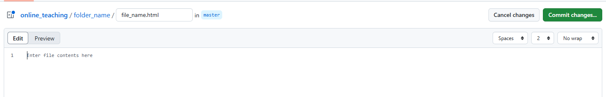

## Uploading Assignments


### Step 1
1. Go to this page, https://github.com/NoumanAhmad448/online_teaching/ and click on ```Add File``` and choose ```Create new File``` button

2. Type ```Ass_3``` and then add ```/``` and type  ```index.html````file.

3. Add your code in the bottom

4. click on ```Publish Button``` in the bottom and choose a new branch
5. Click on ```submit```
