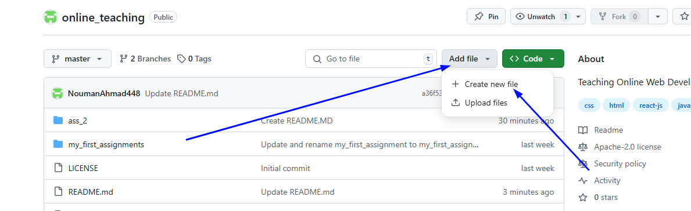
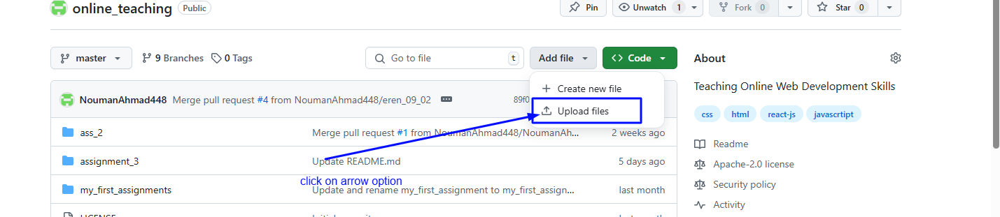
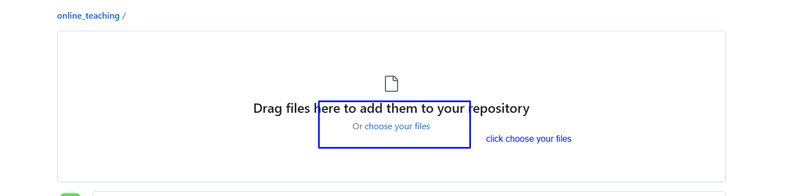

# Uploading Assignments

## Step 1: Creating a New File in the Master Branch

1. **Navigate to the Repository**  
   Go to the repository page: [https://github.com/NoumanAhmad448/online_teaching/](https://github.com/NoumanAhmad448/online_teaching/). Click on the `Add File` button and select `Create new File`.  
   

2. **Name the File**  
   In the file name field, type:  
   ```
   Ass_3/index.html
   ```  
   This will create a folder named `Ass_3` and a file inside it named `index.html`.  
   

3. **Add Your Code**  
   Paste or write your HTML code in the editor at the bottom of the page.  
   

4. **Upload other files**  
   Choose upload file option
   

5. **Choose files**  
   upload all other files
   

6. **Commit the Changes**  
   Scroll down and click on the `Commit changes` button. Make sure to select the `master` branch (or create a new branch if required).  

7. **Submit**  
   Click on the `Submit` button to save your changes.  

